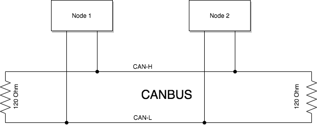
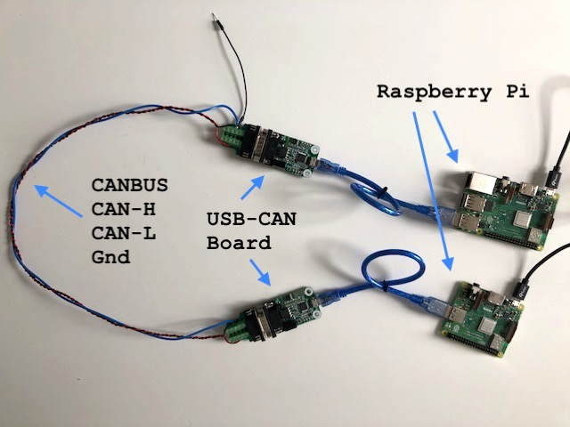

# Vehicle Canbus Simulator
This project allow you to playback CANBUS messages over a local network to aid development without requiring access to a vehicle.

It currently supports (Vector's) `*.asc` CANBUS log files as these are compact and include timing information. (See sample below or [the log file included in this project](./logs/sample-log.asc)

The code is designed to run on unix machines, including the Raspberry Pi. It relies on SocketCAN documented at https://github.com/linux-can/can-utils which makes your CANBUS device available as a standard socket network device. Unfortunately, this code will not work on macOS because can-utils is not supported on OSX.

## CANBUS Networks
A CANBUS network is a two wire network which requires a minimum of two nodes. There can be (many) more than two. There is no concept of master or slave; each node on the network is a peer of the others.

The network works using differential voltage signalling on two wires; normally designated CAN-H and CAN-L. The network also requires a termination resistor (typically 120 ohm) at each end to avoid signal reflection.



Nodes transmit and receive messages at up to 1Mbps. Tesla's CANBUS networks typically run at 500kbps with around 1-2k messages per second transmitted on the bus.

See https://en.wikipedia.org/wiki/CAN_bus for more information.

## Hardware Requirements
The Vehicle Canbus Simulator application requires a USB connected CANBUS transceiver to work. Without it the application is unable to transmit messages from the log file to the CANBUS.

Sample set up using two Raspberry Pi's and two USB-CANBUS boards (from Inno-maker).



It is possible to use a single Raspberry Pi by connecting the two USBs to the pi. You will then need to configure both `can0` and `can1` on the device. Note that a single pi may struggle to send/receive messages without dropping frames at higher CANBUS bit rates.

## Installing Dependencies
For Debian based distros (including the Raspberry Pi), you will need to install `can-utils` on the computer hosting the Vehicle Canbus Simulator application. This is simple to do with the standard Raspbian images (based on Debian).

```
apt-get install can-utils
```

Then connect your CANBUS device to the USB port of the computer.

## Configuring the CANBUS

You will need to configure the CANBUS before starting the CAN Simulator App. 

```
# configure CAN0 with bitrate set to 500kbps
ip link set can0 type can bitrate 500000

# bring the network up
ifconfig can0 up
```

## Replaying Log Files

The purpose of this application is to "replay" log files obtained from your vehicle. This allows you to develop CANBUS applications without being physically connected to the vehicle.

This app currently ONLY supports the (Vector) *.asc CANBUS log file format. Note it may support other file formats in the future. These files are formatted like this:

```
date Wed Oct 2 12:10:32 am 2018
base hex timestamps absolute
Begin Triggerblock Wed Oct 2 12:10:32 am 2018

 1.372237 1  3A2        Rx D 8  AB  04  00  00  00  00  00  00
 1.372976 1  3E8        Rx D 8  02  00  00  00  00  00  00  00
 ...
```

Note only `absolute` timestamps are currently supported; `relative` timestamps may be supported in a future release.

## Launching the Application

Launch on the command line using a terminal (window) with path to the log file that you want to replay.

```
./cansim ../logs/sample-log.asc
```

The following command line options are also supported

```
Usage: ./bin/cansim <options> logfile

      -c <canbus>  (default is can0)
      -i           (infinite or loop forever)
      -l <num>     (process input file <num> times, default=1)
      -m <ms>      (skip gaps in timestamps > <ms> milliseconds)
      -t           (ignore timestamps and send frames with no delay)
      -v           (verbose, show sent messages)
      -x <0/1>     (enable loopback, (0 = off default, 1 = on)
```

Use the options above to control how long the frames will play for, and use Ctrl-C to abort/exit the application.

Check this out to see the Simulator in action.

[](https://player.vimeo.com/video/442717525)


# Test and Build
If you want, you can modify, test and build the app yourself provided you have the standard C build tools installed.

## Unit Tests

Invoke the unit tests using the following command:

```
make clean test
```
The output will indicate whether the tests ran sucessfully or not.

## Building the App

To build the app, use the following command:

```
make clean app
```

This will create an executable called `cansim` in the `bin` directory of the project.

# LICENSE

This program is distributed in the hope that it will be useful,
but WITHOUT ANY WARRANTY; without even the implied warranty of
MERCHANTABILITY or FITNESS FOR A PARTICULAR PURPOSE.  See the
[GNU General Public License for more details](LICENSE).


